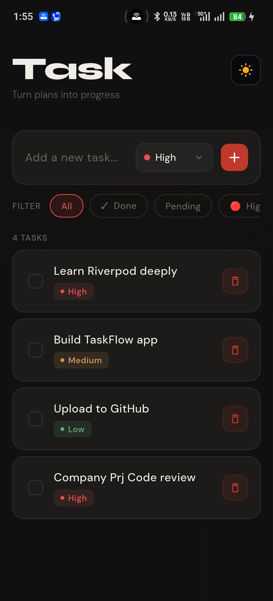
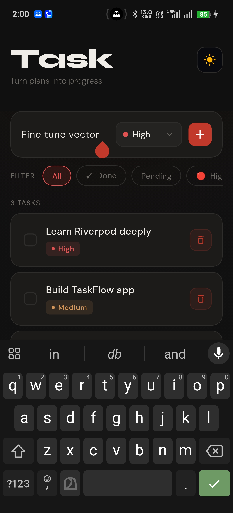
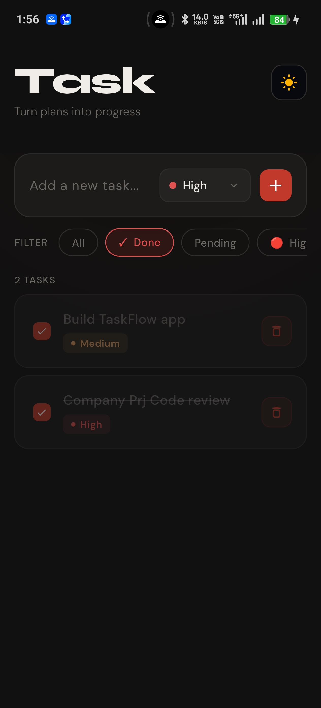
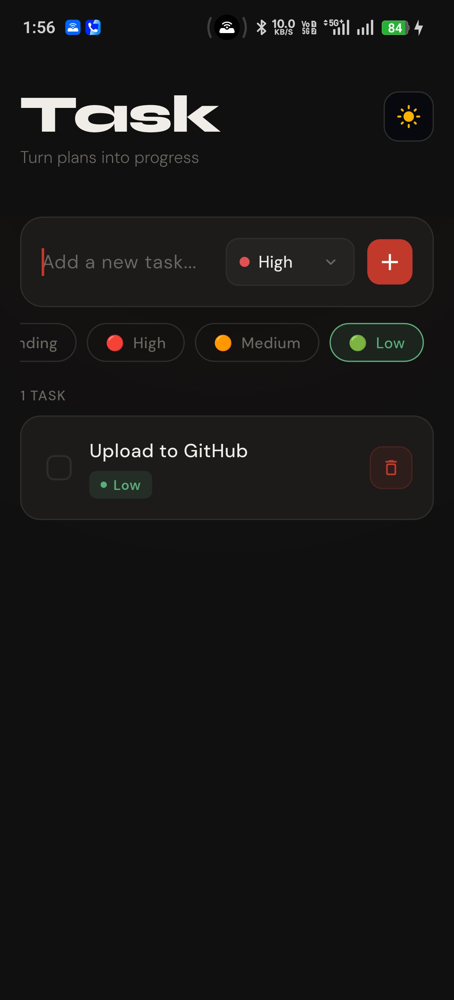
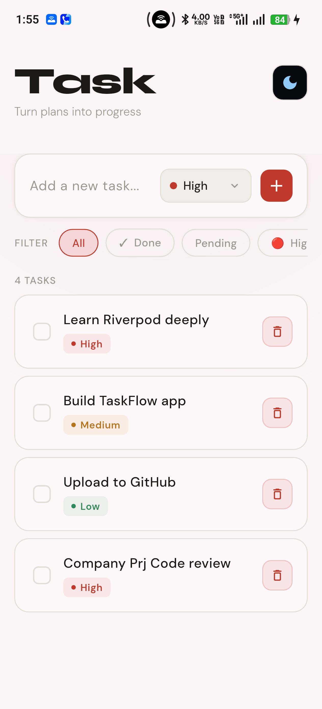

# TaskFlow Riverpod ✅📱

A clean, feature-rich Flutter task management app demonstrating Riverpod-based state management,
async data bootstrapping, and reactive UI updates with filtering and theming.

The project uses **Riverpod** for global and derived state handling, keeping task data,
filters, and theme mode predictable, testable, and well-separated from the UI layer.

---

## ✨ Features

- Add tasks quickly with a focused composer input
- Assign task priority while creating tasks: Low, Medium, High
- Mark tasks as done/undone with instant reactive updates
- Delete tasks from the list with contextual UI behavior
- Filter tasks by All, Done, Pending, High, Medium, and Low
- Async startup flow with dedicated loading and error states
- Simulated API fetch (FutureProvider) merged into app state safely
- Dark/Light mode toggle from the app bar
- Responsive behavior for mobile, tablet, and desktop layouts
- Smooth micro-interactions: hover states, fade/slide list item entrance, animated switches

---

## 🧱 Architecture & Design Decisions

- **Riverpod for State Management**
  - `TasksNotifier` (`tasksProvider`) is the single mutable source of truth for task operations: add, delete, toggle, and initial set
  - `filtersProvider` stores the active list filter
  - `filteredTasksProvider` computes visible tasks from base task state + selected filter (derived, not duplicated)
  - `themeModeProvider` stores app-wide theme mode and removes theme prop drilling

- **Async-first screen composition**
  - `tasksApiProvider` (`FutureProvider`) handles async bootstrapping
  - `AsyncValue.when()` cleanly separates loading, error, and data UI branches
  - API data is applied once to mutable app state via post-frame sync, preventing rebuild-time mutations

- **Explicit immutable updates**
  - `Task` model uses `copyWith` to keep state transitions immutable
  - Toggle operations replace task objects instead of mutating them in place

- **Derived data over duplicated state**
  - Filtering logic lives in a pure provider (`filteredTasksProvider`)
  - UI reads filtered output directly, avoiding manual sync bugs

- **Composable UI structure**
  - `TaskScreenAppBar` handles title and theme toggle controls
  - `TasksComposerCard` isolates input, priority selector, add action, and filter chips
  - `TasksListSection` handles empty states, list rendering, and item actions

---

## 🛠 Tech Stack

- Flutter (Material 3)
- Dart
- flutter_riverpod (state management)
- google_fonts (typography)

---

## 📸 Screenshots

| Main Screen | Composer + Filters | Done Filter |
|---|---|---|
|  |  |  |

| Low Priority Filter | Light Mode | Desktop View |
|---|---|---|
|  |  |  |

---

## 🧠 Key Takeaways

- Riverpod makes state transitions explicit and predictable
- Derived providers keep UI synced without manual coordination
- Separating async fetch state from mutable app state improves reliability
- Global theme state removes unnecessary prop drilling
- Small, focused widgets make UI behavior easier to iterate and maintain

---

## 🔮 Possible Enhancements

- Persist tasks locally (SharedPreferences / Hive / Isar)
- Integrate a real backend (REST/Firebase/Supabase) with proper repository layer
- Add due dates, reminders, and sorting options
- Add edit task and drag-to-reorder support
- Add unit/widget tests for providers and key UI flows

---

## 👨‍💻 Author

**GOKUL HARI**  
Software Engineer